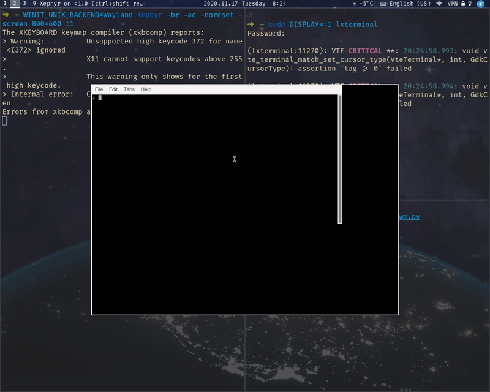

# SPWM
Simple window manager powered on python library for X (Xlib)



## Installation
SPWM can work on py2 and py3.
This is because the syntax is the same at the library level
### Python2
```
sudo pip2 install -r requirements.txt
python spwm.py
```
### Python3
```
sudo pip install -r requirements.txt
python3 spwm.py
```
